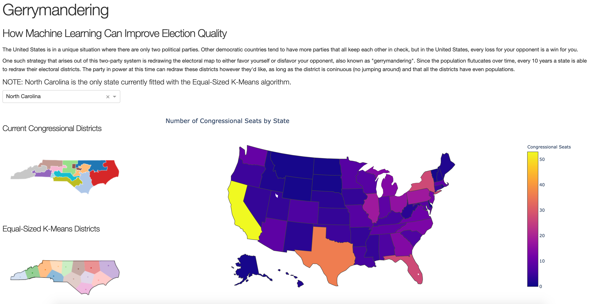

# Gerrymandering

<a rel="license" href="http://creativecommons.org/licenses/by-sa/4.0/"></a><br />This work is licensed under a <a rel="license" href="http://creativecommons.org/licenses/by-sa/4.0/">Creative Commons Attribution-ShareAlike 4.0 International License</a>.

## Overview

Gerrymandering is a fundamental problem that arises when states and provinces need to redistrict due to population fluctuations. I tackle this problem by drawing districts using an equal-sized K-means clustering algorithm and 260 million addresses, pulled from [https://openaddresses.io/](https://openaddresses.io/).



## Description

There are 435 members of the House of Representatives in the United States Congress. Each member is elected by a population represented by equivalent portion of the population of the United States, split by 50 states. These clusters of the population are bounded by the border of the state that they are in.

Every 10 years, Congress can redraw the district lines to recapture the population fluctuations that occur over time. What is interesting is that there is not set algorithm for redrawing these lines; they are drawn by hand and drawn by the party in power. To vote in a member of Congress, the winning majority is 50% plus 1. If you can draw districts to dilute an existing majority by spreading them across many districts (also know as "cracking") or by condensing an existing majority to a few districts (also known as "packing"), the election results can be altered. This practice is called "Gerrymandering". To "Gerrymander" a district, you draw a continuous district boundary with the sole purpose to misrepresent the true political opinion of that state, whether it is by political party or by demographic.


My approach to redraw district lines is to apply a clustering algorithm to each address in my dataset (~260 million addresses), specifically an equal-sized K-means clustering algorithm. This algorithm allows control over the number of clusters (the number of congressional districts) and control over the number of people in each cluster (districts need to have equal populations by law).

## Usage

#### Dependencies

This project uses the following dependencies:

```
jupyter
pandas
numpy
tqdm
matplotlib
plotly
plotly.express
dash
dash_bootstrap_components
scikit-learn==0.19.2
geopandas
geovoronoi[plotting]
```

These can all be installed via `pip.`

#### Application

The `dash` application can be run locally by running the following command in your terminal:

```
python dash/app.py
```

If your browser doesn't automatically open the application, you'll need to navigate to the port that your terminal directs you to (the port the opens for my machine is: http://127.0.0.1:8050/).
